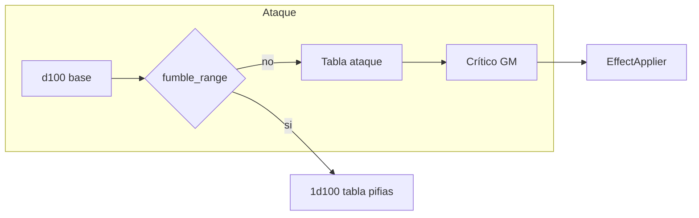

# Mapa efectos de arma (RMSS 9.7.x) vs sistema RMSS

## Alcance

- **Solo armas**: fases 1–2, datos/encantamientos 9.7.x y la lógica asociada (**iniciativa por ítem equipado**, cadena **Effect Weapon** / consultas de crítico, **Weapon of Bleeding**) aplican **únicamente** a ítems **`type: weapon`** (u homólogo RMSS). No se extiende a armadura, escudo u otros tipos de ítem salvo decisión explícita en otro plan.
- **UI**: controles, tooltips y textos de estos efectos deben **mostrarse solo en la hoja de arma**; no en fichas de otros ítems.

### Dónde en la hoja de arma (pestañas actuales)

Referencia: [`templates/sheets/items/rmss-weapon-sheet.html`](templates/sheets/items/rmss-weapon-sheet.html) — **Detalles** | **Modificadores** | **Magia**.

- **Decisión (roadmap)**: los controles de Fase 1–2 (**Increased Initiative**, **Effect Weapon** / *Increased Critical* si se expone en datos, **Weapon of Bleeding**) van en la pestaña **Modificadores** (mismo bloque que `of_changing`, holy/slaying, bonus, etc.). Implementar ahí el markup y estilos necesarios.
- **Magia**: solo la **lista de encantamientos**; sin formularios largos de reglas 9.7 en esa pestaña.
- **Detalles**: sin ampliar para estos efectos.
- **Nueva pestaña**: reservada solo si en el futuro **Modificadores** quedara ingobernable; no es el plan actual.

## Excluido explícitamente (no entra en esta hoja de ruta)

- **Reducción de pifia** (Minor / Normal / Greater / Superior Decreased Fumble): no se implementará en esta línea de trabajo; el flujo de pifia sigue como está.
- **Duelo de voluntades y gestión de armas inteligentes** (reactores de alineación, guardianes, ataques del arma al portador, etc.): fuera de alcance.
- **Reglas de distancia** (Increased Range, point blank, tramos cortos/medios, etc.): ya están contempladas como **TODO futuro** en el proyecto; **no se detallan ni se priorizan aquí**.
- **Slaying en todas sus formas** (Individual, grupos limitado/general, True, y cualquier automatismo por tipo de víctima): **descartado de momento**; depende de un **sistema de tagging** que aún no existe. El GM puede seguir usando la columna **slaying** en el diálogo de crítico para criaturas grandes/supergrandes donde ya existe en el motor; lo que no se hará es matching automático.
- **% de actividad al desenfundar / recargar** (Minor / Normal / Greater / Superior Speed Weapon): descartado.
- **Minor Defender** y **Defender** (parada con OB fraccional bajo stun): descartado.
- **Returning** (Lesser, normal, Far): no se implementa; queda **mesa / hechizos** si aplica.
- **Armor and Shield Slayer** (RR, destrucción de armadura/escudo): fuera de este plan; requiere diseño amplio — **llevar a issue en GitHub** (ver abajo).

---

## Backlog sugerido para GitHub (no bloquea el roadmap actual)

Abrir o agrupar issues cuando toque; son ideas a darles vueltas más adelante:

1. **Slaying + tagging**: tags en actores/objetivos y reglas para aplicar crítico slaying / OB +10 / grupos sin depender solo del GM.
2. **Armor and Shield Slayer** (y enlace con efectos tipo *Arms Destroyer* / rotura de objetos): RR a objetos, destrucción, interacción con armadura equipada.
3. **Returning weapons**: teletransporte al final de asalto, alcance, anclaje a otro ítem (Far Returning).
4. **Rotura de arma en combate**: reglas del manual para comprobar si el arma **rompe** durante el combate (tiradas, penalizadores, `breakage_range` / material, etc.). **Prerrequisito** para automatizar propiedades como ***Weapon Slayer*** (parada con rotura enemiga −100 o destrucción): hasta existir ese sistema, *Weapon Slayer* queda **manual** o sin soporte mágico dedicado. **Issue:** [rubendelblanco/RolemasterSS#112](https://github.com/rubendelblanco/RolemasterSS/issues/112).
5. **Arms Destroyer** (RM 9.7.4; en inglés *Arms* = armas **y** armadura enemiga, no es solo “Armor”): combina lógica tipo *Weapon Slayer* + *Armor/Shield Slayer*; depende de rotura de arma y RR/destrucción de objetos. **Issue:** [rubendelblanco/RolemasterSS#113](https://github.com/rubendelblanco/RolemasterSS/issues/113).

---

## Arquitectura relevante

- **Ataque**: [`RMSSWeaponSkillManager.handleAttack`](module/combat/rmss_weapon_skill_manager.js) → tirada abierta → **pifia** si el d100 base ≤ `weapon.system.fumble_range` → tabla de ataque → **crítico** vía [`RMSSWeaponCriticalManager`](module/combat/rmss_weapon_critical_manager.js) y diálogo GM [`templates/combat/confirm-critical.hbs`](templates/combat/confirm-critical.hbs).
- **Arma**: flags en [`template.json`](template.json) (`holy`, `unholy`, `magical`, `material`, `slaying` texto informativo, `of_changing`, `magic.enchantments[]` con `attackBonus`, etc.). **`system.slaying` no alimenta lógica automática** de combate.
- **Críticos grandes**: subtipo de columna (`normal` / `magic` / `mithril` / `holy` / `slaying`) en [`getDefaultCriticalSubtype`](module/combat/rmss_weapon_critical_manager.js) y en el diálogo GM; la opción **slaying** es **selección manual**, no por tags.
- **Efectos de resultado de crítico** (stun, HPR/sangrado, parada…): [`RMSSEffectApplier`](module/combat/rmss_effect_applier.js).
- **Pifia de arma**: resultado **1d100** tras activar pifia → [`WeaponFumbleService`](module/combat/services/weapon_fumble_service.js). *(Sin extensión por encantamiento en este plan.)*
- **Iniciativa**: fórmula global en [`rmss.js`](rmss.js) (`CONFIG.Combat.initiative`); **sin bonos por ítem equipado** hoy.
- **Changing (Two / Three / Four Form)**: **cubierto a nivel mesa** con la variable **`system.of_changing`** (u otra marca en la ficha del arma): el jugador/GM cambia tipo/tabla/ítem según la situación; **no hace falta lógica adicional** en el sistema para el efecto de “formas”.
- **Dos mecánicas distintas (no confundir):**
  1. ***Effect Weapon*** (Minor / Normal / Greater / Superior en la parte de “crítico extra” con **otra severidad**): según manual, se hace **una sola tirada** (el mismo **resultado de d100** / tirada abierta); ese valor se **aplica a ambos grados** al consultar la tabla — p. ej. un resultado se lee como si fuera **A** y el mismo resultado como **C** (las severidades concretas dependen del ataque principal y del desplazamiento del encantamiento). **No** son dos tiradas distintas.
  2. **Crítico de grado F o mayor** (p. ej. *Increased Critical* que sube a F, *Superior Effect Weapon* cuando el resultado lleva a **> E**, y sobre todo **ataques DE** con tablas que admiten columna **> E**): **solo entonces** se hacen **dos tiradas de crítico independientes** y el mensaje de chat lleva **dos botones** (uno por tirada). Mientras **todas** las resoluciones de crítico del golpe queden en **A–E**, sigue **una sola** tirada y **un** botón (salvo que *Effect Weapon* pida dos **consultas** con esa misma tirada, como en el punto 1).

---

## 9.7.1 WEAPON II

| Efecto | Estado en RMSS | Notas |
|--------|----------------|--------|
| **Individual Slayer** | **Excluido** (slaying auto) | Cualquier automatismo slaying queda **pendiente de tagging** (issue GitHub). Un **+10 OB** contra un blanco concreto sigue siendo **manual** en confirm-attack / encantamiento `attackBonus` si encaja. |
| **Minor Decreased Fumble** | **Excluido** | Ver sección exclusiones. |
| **Minor Effect Weapon** | No | Segundo crítico **−2** severidades, tipos permitidos: **misma tirada** aplicada a **dos grados** (ver “Dos mecánicas distintas” arriba). |
| **Minor Increased Initiative** | No | +2: hook `Combat#rollInitiative` o acumulador en actor desde arma equipada. |
| **Minor Increased Range** | **Excluido** | TODO distancia del proyecto; no este plan. |
| **Minor Speed Weapon** | **Excluido** | % actividad desenfundar/recarga. |
| **Weapon of Bleeding** | No | Tras crítico con HPR: ajustar valor del efecto según severidad A–C (+1) / D–E (+2). **Fase 2 del roadmap.** |
| **Two Form Weapon** | **Cubierto (variable)** | Marcar el arma con **`of_changing`** (o convención de mesa); cambios de forma/tabla son **manuales**. |

---

## 9.7.2 WEAPON III

| Efecto | Estado | Notas |
|--------|--------|--------|
| **General Alignment Reactor** | **Excluido** | Voluntad / arma inteligente. |
| **Limited Group Slaying** | **Excluido** | Slaying automático → issue tagging / GitHub. |
| **Minor Defender** | **Excluido** | Ver sección exclusiones. |
| **Normal Decreased Fumble** | **Excluido** | Ver sección exclusiones. |
| **Normal Effect Weapon** | No | Extra crítico **−1** severidad; **misma tirada** para ambos grados (como *Minor Effect Weapon*). |
| **Normal Increased Initiative** | No | **+4**. |
| **Normal Increased Range** | **Excluido** | TODO distancia del proyecto. |
| **Normal Speed Weapon** | **Excluido** | % actividad desenfundar/recarga. |
| **Weapon of Lesser Returning** | **Excluido** | Issue GitHub / mesa. |
| **Three Form Weapon** | **Cubierto (variable)** | Igual que Two Form: **`of_changing`** + gestión manual de formas. |

---

## 9.7.3 WEAPON IV

| Efecto | Estado | Notas |
|--------|--------|--------|
| **Armor and Shield Slayer** | **Backlog GitHub** | Fuera del plan actual; diseño complejo (RR, objetos, escudos). |
| **Assassin’s Weapon** | No | Reprogramación con objeto personal + comando: **narrativo**. |
| **Critical Alignment Reactor** | **Excluido** | Voluntad / arma inteligente. |
| **Defender** | **Excluido** | Ver sección exclusiones. |
| **Four Form Weapon** | **Cubierto (variable)** | Igual: **`of_changing`** + manual. |
| **General Group Slaying** | **Excluido** | Slaying + tagging → GitHub. |
| **Greater Concussive / Superior Concussive** | Parcial | Diálogo de crítico: multiplicador de daño (×2…×6); el GM refleja ×2/×3 de contusión; **no distingue** tipo de daño automáticamente. |
| **Greater Decreased Fumble** | **Excluido** | Ver sección exclusiones. |
| **Greater Effect Weapon** | No | Extra crítico **misma** severidad: **una tirada**, dos lecturas en el **mismo** grado (o equivalente según tabla). |
| **Greater Increased Initiative** | No | **+6**. |
| **Greater Increased Range** | **Excluido** | TODO distancia del proyecto. |
| **Greater Speed Weapon** | **Excluido** | % actividad. |
| **Holy Weapon** (regla completa vs malvados / segunda columna Holy) | Parcial | `holy`/`unholy` → subtipo **holy** en críticos grandes; **no** la regla de doble columna según tamaño/malvado. |
| **Increased Critical** | No | Subir un escalón **A→E**: **una** tirada / un botón. Si el grado efectivo pasa a **> E** (**F** o más): **dos tiradas** y **dos botones** (regla 2 arriba; típico también en **DE**). |
| **Increased Potency** | **Cubierto (mesa)** | Basta con cambiar **`system.attack_table`** (y coherente `critical_type` / etc.) en la ficha del arma; **no requiere** lógica extra en el sistema. *(Distinto de **Superior Increased Potency**, que habla de cualquier tabla conservando fumble/fuerza/rotura del arma original.)* |
| **Weapon of Returning** | **Excluido** | Issue GitHub / mesa. |
| **Weapon Slayer** | **Backlog GitHub** | Tirada de rotura del arma enemiga con **−100** o destrucción. **Depende** de [#112](https://github.com/rubendelblanco/RolemasterSS/issues/112); mientras tanto **manual** en mesa. |

---

## 9.7.4 WEAPON V

| Efecto | Estado | Notas |
|--------|--------|--------|
| **Arms Destroyer** | **Backlog GitHub** | Ver [#113](https://github.com/rubendelblanco/RolemasterSS/issues/113). Depende de rotura de arma ([#112](https://github.com/rubendelblanco/RolemasterSS/issues/112)) y de *Armor/Shield Slayer* (backlog). |
| **Guardian Defender** | **Excluido** | Arma autónoma / inteligencia. |
| **Slaying Weapon True** | **Excluido** | Slaying + tagging → GitHub. |
| **Superior Decreased Fumble** | **Excluido** | Ver sección exclusiones. |
| **Superior Effect Weapon** | No | Extra **+1** severidad respecto al principal: por defecto **misma tirada** en dos grados (regla 1). Si **algún** grado a resolver queda **> E**, aplica **dos tiradas** / **dos botones** (regla 2). |
| **Superior Increased Initiative** | No | **+8**. |
| **Superior Increased Potency** | No | Cualquier tabla manteniendo fumble/fuerza/rotura: **muy complejo**. |
| **Superior Increased Range** | **Excluido** | TODO distancia del proyecto. |
| **Superior Speed Weapon** | **Excluido** | % actividad (100% = gratis): descartado con el bloque speed. |
| **Weapon of Justice** | **Excluido** | Voluntad / arma inteligente; fuera del alcance acordado. |
| **Weapon of Far Returning** | **Excluido** | Issue GitHub / mesa. |

---

## Recomendación de fases (lo que queda en el roadmap)

1. **Fase 1**  
   - **Increased Initiative** (Minor→Superior): hook de iniciativa + suma desde armas equipadas.  
   - **Effect Weapon** (Minor/Normal/Greater/Superior): **una tirada** compartida; **dos consultas** a tabla con severidades (y tipos) según regla del encantamiento; si el caso entra en **> E**, pasar a flujo de **dos tiradas** (regla 2).

2. **Fase 2**  
   - **Weapon of Bleeding** únicamente: tras aplicar HPR desde crítico, incrementar hits/asalto según severidad del crítico principal (A–C / D–E).

3. **Manual / documentación**  
   - **Changing**: recordatorio en hoja de arma / tooltip de usar **`of_changing`**.  
   - **Distancia**, **pifia reducida**, **slaying auto**, **speed draw**, **defender**, **returning**, **armor/shield slayer**: no forman parte de este roadmap; parte en **issues GitHub**.

---

## Archivos clave para futuras extensiones

- Críticos: [`module/combat/rmss_weapon_critical_manager.js`](module/combat/rmss_weapon_critical_manager.js), [`templates/combat/confirm-critical.hbs`](templates/combat/confirm-critical.hbs)  
- Efectos: [`module/combat/rmss_effect_applier.js`](module/combat/rmss_effect_applier.js)  
- Ataque / pifia (referencia): [`module/combat/rmss_weapon_skill_manager.js`](module/combat/rmss_weapon_skill_manager.js), [`module/combat/services/weapon_fumble_service.js`](module/combat/services/weapon_fumble_service.js)  
- Datos ítem: [`template.json`](template.json) (weapon), [`module/sheets/items/enchantment_utils.js`](module/sheets/items/enchantment_utils.js)  
- Iniciativa: [`rmss.js`](rmss.js) (`CONFIG.Combat.initiative`)
